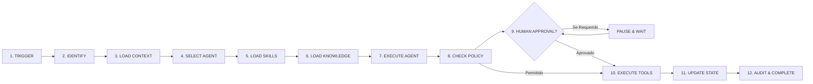

# 🧠 AI Operating System (AiOS)

> **Infraestrutura-base e Sistema Operacional de IA para Empresas.**  
> *O template é o produto de infraestrutura; a empresa do cliente é uma configuração sobre essa infraestrutura.*

[](https://opensource.org/licenses/Apache-2.0)
[](https://nodejs.org/)
[](https://docs.docker.com/compose/)
[](#testes)

---

## 🏛️ Visão Geral

O **AI Operating System (AiOS)** é um repositório template pronto para implantação empresarial. Ele fornece a fundação necessária para orquestrar agentes autônomos, gerenciar bibliotecas de *Skills* (`SKILL.md`), conectar *Knowledge Bases* com busca vetorial (`pgvector`), aplicar *Políticas Determinísticas* de segurança e gerenciar decisões críticas com aprovação humana (*Human-in-the-Loop*).

O AiOS não é um simples chatbot. Ele foi projetado como o **sistema operacional corporativo** onde processos empresariais complexos são executados com rastreabilidade total, governança e conformidade.

---

## ⚡ O Pipeline Universal de 12 Etapas

Todo processo empresarial é executado através da abstração de primeira classe do AiOS:



1. **TRIGGER**: Recepção de evento (Webhook, API, Agendamento ou Manual).
2. **IDENTIFY**: Roteamento determinístico imediato ou delegação para o Agente Orquestrador.
3. **LOAD CONTEXT**: Hidratação de entidades e memórias persistentes.
4. **SELECT AGENT**: Seleção do agente autorizado com base no *Job Description*.
5. **LOAD SKILLS**: Carregamento dinâmico das definições declarativas `SKILL.md`.
6. **LOAD KNOWLEDGE**: Consulta semântica vetorial ao PostgreSQL + `pgvector`.
7. **EXECUTE (Agente)**: Síntese de raciocínio e proposta de ação.
8. **CHECK POLICY**: Avaliação determinística por regras corporativas (`ALLOW`, `DENY`, `HUMAN_REQUIRED`).
9. **HUMAN APPROVAL (HITL)**: Pausa o workflow em `WAITING_APPROVAL` se limites forem ultrapassados.
10. **EXECUTE (Tools & Efeitos Colaterais)**: Execução real das chamadas a ERP, CRM, APIs e MCPs após aprovação.
11. **UPDATE STATE**: Atualização de estado da entidade e gravação de novas memórias.
12. **AUDIT & COMPLETE**: Registro de auditoria imutável e finalização.

---

## 📦 Estrutura do Repositório

```
AiOS/
├── apps/
│   ├── api/                  # Backend Fastify + TypeScript + Postgres/pgvector
│   │   ├── src/modules/      # Modules: Agents, Skills, Workflows, Policies, Approvals, Knowledge, Tools, Audit
│   │   └── tests/            # Testes Unitários, Integração e E2E
│   └── control-center/       # Frontend SPA em Vanilla CSS/JS moderno e responsivo
├── agents/                   # Configurações JSON dos Agentes (Orchestrator, Finance, Sales, Support)
├── skills/                   # Biblioteca de SKILL.md (Core, Shared, Templates)
│   ├── core/                 # request-approval, etc.
│   ├── shared/               # validate-financial-limit, notify-stakeholder, etc.
│   └── templates/            # process-invoice, etc.
├── workflows/                # Definições de Workflows e Pipelines
├── policies/                 # Regras determinísticas de governança
├── infrastructure/           # Docker Compose, PostgreSQL init + migrations, n8n templates
├── bin/                      # CLI executável (aios)
├── scripts/                  # Scripts de instalação, backup, restore e health check
└── docs/                     # Documentação completa da arquitetura
```

---

## 🚀 Como Instalar e Rodar

### Pré-requisitos
- **Linux / macOS / Windows (WSL ou PowerShell)**
- **Docker e Docker Compose** (ou Node.js >= 20 para execução local direta)

### 1. Clonar e Instalar via Script Automático

```bash
# Clone seu repositório
git clone https://github.com/sua-org/aios.git
cd aios

# No Linux / macOS:
chmod +x scripts/*.sh
./scripts/install.sh

# No Windows (PowerShell):
npm install
npm run build
npm run dev:api
```

### 2. Acessar o Control Center
Abra seu navegador em: **[http://localhost:8080](http://localhost:8080)**

No primeiro acesso, o **Setup Wizard** será exibido para você configurar os dados da empresa, criar o usuário administrador e carregar os agentes e o workflow de demonstração.

---

## 💻 AiOS CLI

O sistema inclui uma interface de linha de comando para administração:

```bash
# Verificar integridade do sistema
node ./bin/aios.js health

# Executar Setup Wizard via terminal
node ./bin/aios.js setup

# Listar agentes registrados
node ./bin/aios.js agent list

# Listar skills da biblioteca
node ./bin/aios.js skill list

# Disparar o workflow de demonstração
node ./bin/aios.js workflow run universal-invoice-pipeline

# Listar e aprovar solicitações humanas
node ./bin/aios.js approval list
node ./bin/aios.js approval approve <approval_id>

# Visualizar logs de auditoria
node ./bin/aios.js logs
```

---

## 🧪 Testes Automatizados

O repositório possui uma suíte completa de testes unitários, de integração e End-to-End:

```bash
# Executar todos os testes
npm test

# Testes unitários (Policy Engine, SKILL Parser, Router, Approvals)
npm run test:unit

# Testes de integração (Database, Setup Wizard, Knowledge Base)
npm run test:integration

# Teste End-to-End (Pipeline de 12 etapas com pausa e aprovação humana)
npm run test:e2e
```

---

## 📚 Documentação Adicional

Acesse os guias detalhados na pasta [`docs/`](./docs/):
- [🏛️ Arquitetura do Sistema](./docs/architecture.md)
- [🏁 Guia de Início Rápido](./docs/getting-started.md)
- [⚙️ Configuração de Ambiente](./docs/configuration.md)
- [🤖 Agentes e Job Descriptions](./docs/agents.md)
- [🧩 Especificação de Skills (SKILL.md)](./docs/skills.md)
- [🔄 Workflows e n8n](./docs/workflows.md)
- [📚 Knowledge Layer & pgvector](./docs/knowledge.md)
- [🔌 Tools e Integrações MCP](./docs/tools.md)
- [⚖️ Políticas Determinísticas](./docs/policies.md)
- [🛡️ Human-in-the-Loop & Aprovações](./docs/approvals.md)
- [🔒 Segurança e RBAC](./docs/security.md)
- [🚀 Guia de Deploy em Produção / VPS](./docs/deployment.md)
- [🛠️ Troubleshooting e Diagnósticos](./docs/troubleshooting.md)

---

## 📄 Licença

Este projeto é distribuído sob a licença [Apache 2.0](LICENSE).
