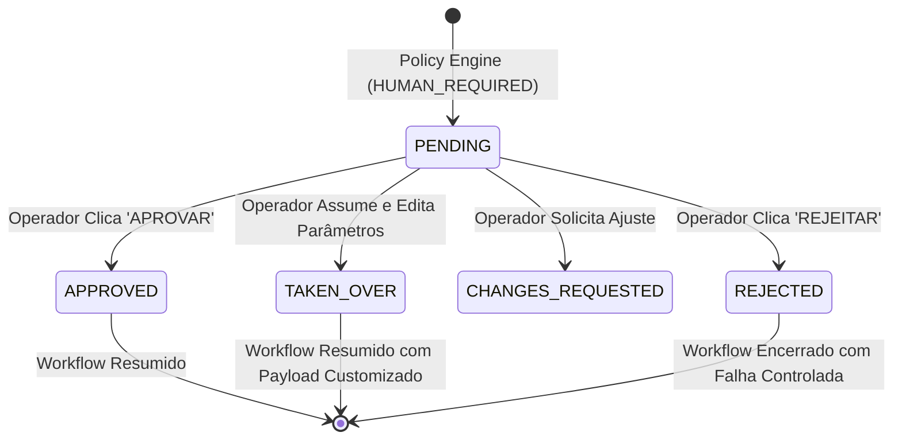

# Human-in-the-Loop & Central de Aprovações

O AiOS implementa o conceito de que **a autonomia da IA termina onde o risco empresarial começa**.

## Ciclo de Vida de uma Aprovação

## Ações do Operador Humano no Control Center
- **APROVAR (Approve)**: Libera o workflow exatamente como planejado pelo agente.
- **REJEITAR (Reject)**: Cancela a execução e registra o motivo para auditoria.
- **SOLICITAR AJUSTES (Request Changes)**: Devolve para o agente com observações.
- **ASSUMIR MANUALMENTE (Take Over)**: Permite ao humano sobrescrever os parâmetros da ação antes de disparar o efeito colateral.
