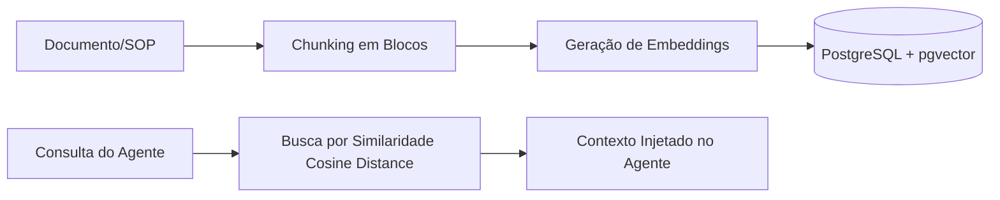

# Camada de Conhecimento (Knowledge) & pgvector

O AiOS separa categoricamente:
- **Knowledge**: Informações documentais estáticas ou semi-estáticas (SOPs, manuais, políticas, legislação).
- **Memory**: Fatos persistentes aprendidos sobre clientes ou preferências do usuário.
- **State**: O estado operacional atual de uma tarefa ou workflow.

## Pipeline de Ingestão e RAG

A busca semântica é realizada diretamente no PostgreSQL com indexação HNSW em vetores de 1536 dimensões (`vector_cosine_ops`).
